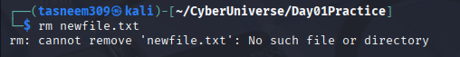

# Day 01 - Git Practice

## Commands I Practiced:
- pwd
- mkdir
- cd
- touch
- ls
- ls -la
- mv
- cp
- rm
- rmdir
- history
- echo
- cat
- nano
- file
- du
- find
- gzip
- gunzip
- clear

## error I faced and what happened:
I tried to remove a non-existing file, so an error appeared
rm newfile.txt                                                                                                 
rm: cannot remove 'newfile.txt': No such file or directory
This happened because the file was not created before trying to remove it.

## Most Useful Command:
I found `ls` very useful to always check changes in files (create, remove, move, and copy)

## My confidence level after Day 1 is: 
9/10

