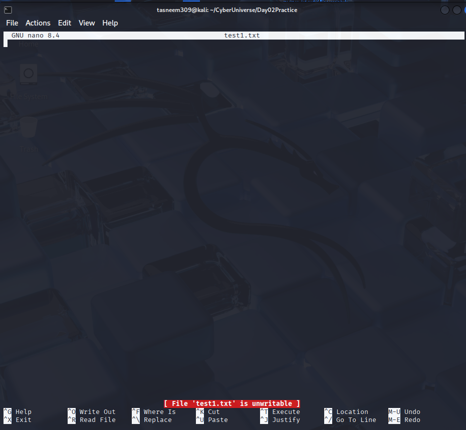
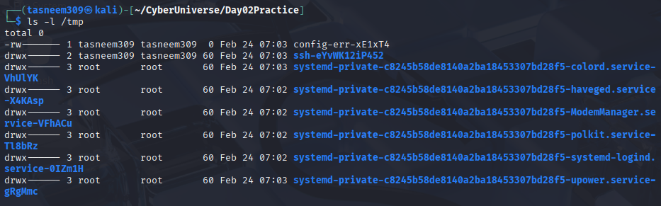

# Day 02 - Linux Permissions Practice

## Permissions I Modified:
I removed the write user permission from one file "test1.txt" using:
chmod u-w test1.txt

Then I restored it using:
chmod u+w test1.txt

## What Happened When Write Permission Was Removed:
When I removed the write permission, I was not able to edit or save changes to the file as a normal user.
The system denied modification because the file was set to read-only.

## Difference Between Normal User and Root:
A normal user has limited access and cannot modify system files.
Root has full administrative privileges and can access, modify, or delete any file in the system.

## Why Linux Permissions Are Important:
Linux permissions are important for system security.
They prevent unauthorized users from modifying sensitive files and help protect the system from misuse.
