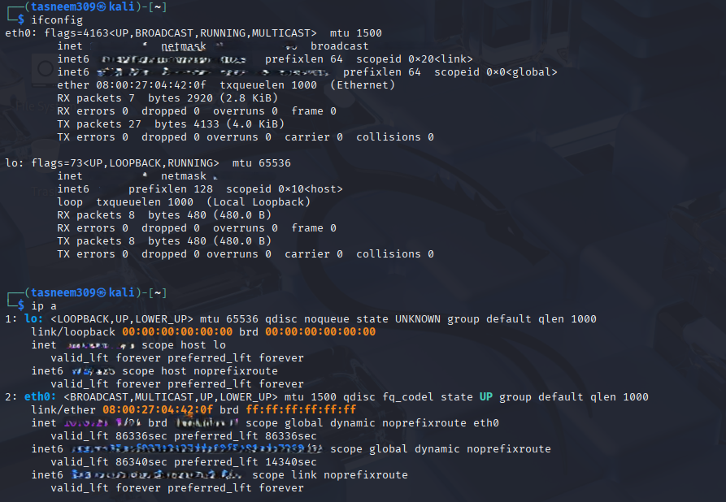
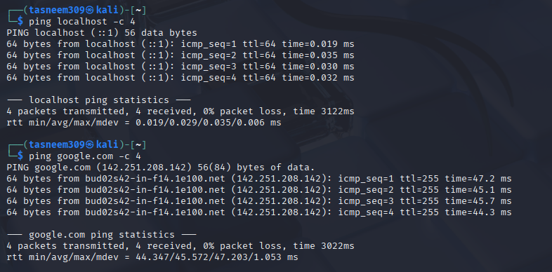
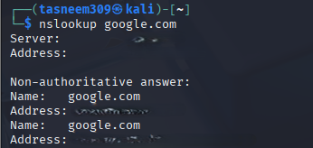

# Day 03 Networking Basics

## Networking Interfaces
I used 'ip a' and 'ifconfig':
- lo (loopback) for internal communication.
- eth0 as the main network interface.

## Ping Results
I tested connectivity 4 times using:
- 'ping 127.0.0.1 -c 4' → successful (local network)
- 'ping google.com -c 4' → response received (internet connectivity)

## Resolving google.com Using nslookup
I used `nslookup google.com` and it returned IP addresses, showing that the domain name was successfully resolved into network addresses.

## Networking Concept That Confused Me
At first, DNS resolution and how domain names become IP addresses were unclear enough, but practicing nslookup helped me understand the process.
