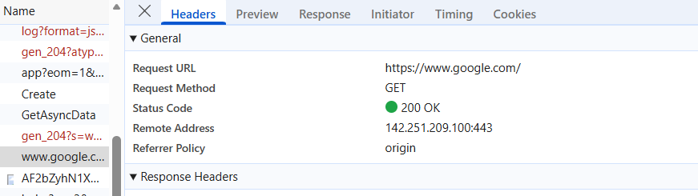
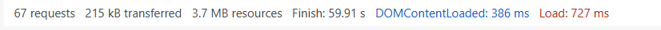

# Day 04 – Web Basics & HTTP Observation

## One Request I Observed
While inspecting the Network tab, I selected a GET request used to load the main page and examined its headers.

The request URL, method (GET), and response status code indicated that the browser was retrieving the main HTML document required to render the page.

This demonstrates how browsers request resources from a server before displaying a website.

## One Status Code and Its Meaning
Status Code: 302 Found

The 302 status code indicates a temporary redirection.

Instead of returning the requested resource directly, the server instructs the browser to request the resource from another URL.

This commonly occurs in situations such as:
- Redirecting from HTTP to HTTPS
- Redirecting users to a login page
- Temporary URL changes

## Difference Between HTTP and HTTPS
HTTP (HyperText Transfer Protocol) is the protocol used for communication between the browser and the server.

HTTPS is the secure version of HTTP.
It encrypts data using TLS/SSL, which protects information from being intercepted or modified during transmission.

In simple terms:
HTTP → Data is sent in plain text  
HTTPS → Data is encrypted and secure

## One Thing That Surprised Me
I was surprised by how many requests a browser makes to load a single webpage.

