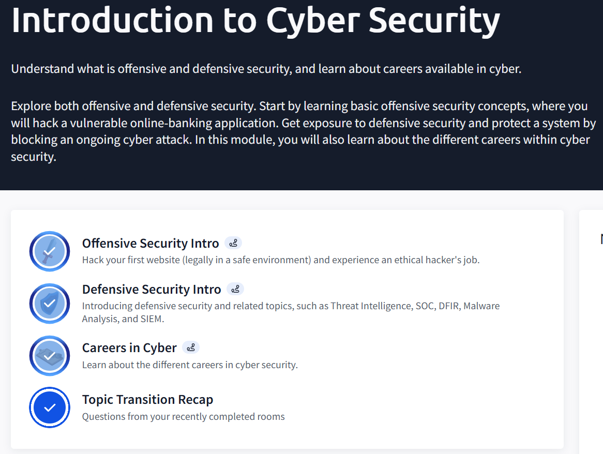
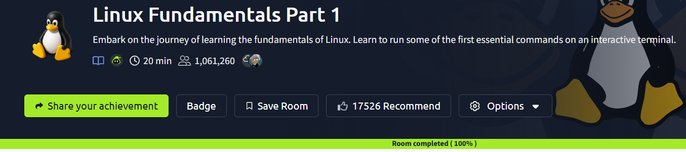

# Day 05 - TryHackMe Practical

## Rooms Completed
- Introduction to Cyber Security (Module)

  

- What is Networking? (Concept studied via external resources)

  
  
- Linux Fundamentals Part 1 (Completed 100%)

  

## Key Concepts Learned
- **Offensive Security:** Learning how to legally hack a website and understanding the ethical hacker's role.
- **Defensive Security:** Understanding Threat Intelligence, SOC, and SIEM to protect systems.
- **Linux Basics:** Navigating the interactive terminal and running essential commands.
- **Networking Foundations:** Studied the OSI model, IP addresses, and how data packets travel.

## New Concept
One of the most interesting concepts was the **"Defense in Depth"** approach, which explains how multiple security layers provide continued protection even if one layer fails.

## Challenge Faced
The "What is Networking?" room was premium, so the challenge was to find alternative ways to learn the same concepts through walkthroughs and documentation to ensure I didn't miss the core knowledge.
