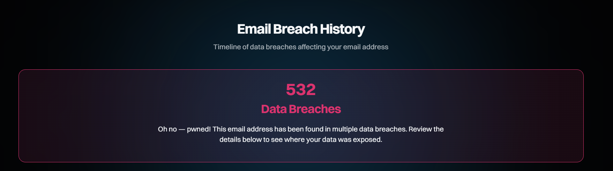
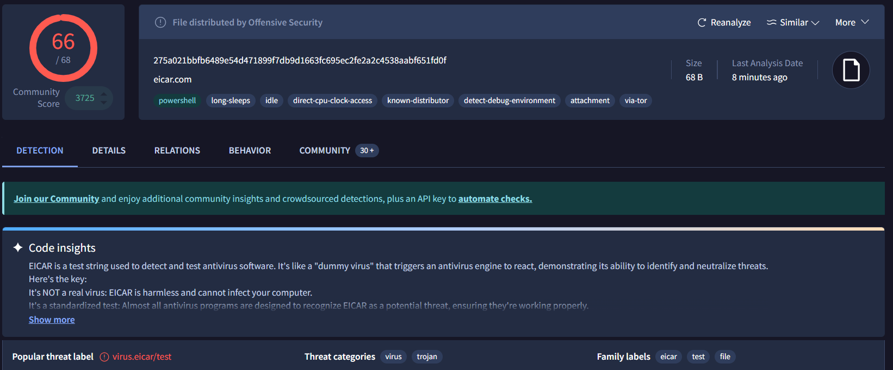

# Day 08 – Data Breach Awareness & Threat Intelligence Basics

## 1. Data Breach Investigation (HaveIBeenPwned)
- **Email Checked:** test@gmail.com (Sample Email)
- **Result:** Pwned!
- **Breach Name:** KomikoAI
- **Date of Breach:** Feb 2026
- **Data Exposed:** AI prompts, Email addresses, Forum posts, Names.
- **Observations:** This demonstrates how third-party breaches can expose sensitive personal activity beyond just passwords.

## 2. IP Address Analysis (VirusTotal)
- **IP 185.220.101.182:**
   - **Detection:** 14/94 (Flagged as Malicious/Suspicious).
   - **Observations:** This IP is identified as a **Tor Exit Node**. Community context indicates involvement in **SSH brute-force login attempts** tracked by platforms like AlienVault and Guardpot.

- **IP 103.21.244.0:**
   - **Detection:** 0/94 (Clean/Harmless).
   - **Observations:** This IP belongs to **Cloudflare**, a legitimate CDN. It has a clean reputation because it is used for web traffic optimization and security.

## 3. File Hash Analysis (VirusTotal)
- **Hash:** `44d88612fea8a8f36de82e1278abb02f`
- **Detection Ratio:** **66/68** security vendors flagged this hash.
- **Malware Classification:** **EICAR-Test-File.**
- **Observations:** This is a standardized test file used to verify if antivirus software is functioning correctly. Security engines flag it as a threat by design to demonstrate their detection capabilities; it is not a real malicious virus.

## 4. Key Learning
Today I learned how to use **Open-Source Intelligence (OSINT)** tools like VirusTotal and HaveIBeenPwned. I now understand the difference between a malicious IP used for attacks and a clean IP used by security companies. I also learned that a high detection rate on VirusTotal doesn't always mean a file is harmful; it could be a standardized test like EICAR.
