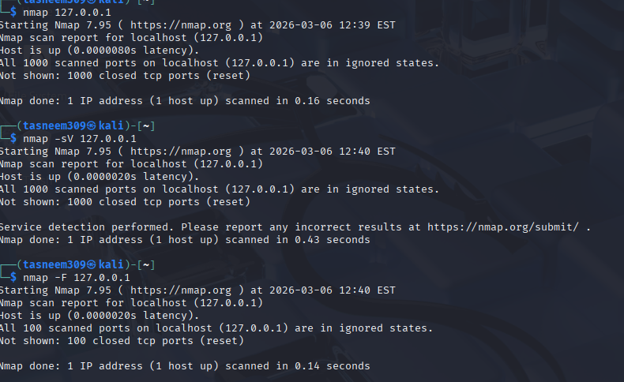
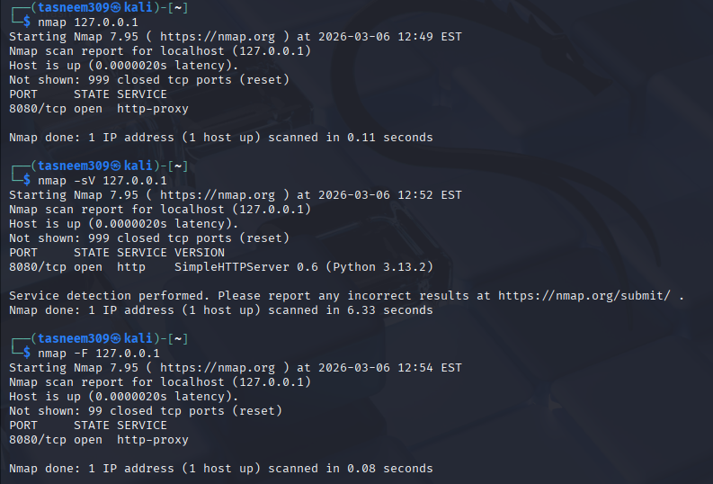

# Day 09 – Network Scanning Basics (Nmap)

## 1. Initial State (All Ports Closed)
Before running any services, I performed scans to check the default security state of my system.
- **Result:** All 1000 ports were **Closed**. 
- **Observation:** This indicates that no services were listening for connections, which is a secure default state.

## 2. Active State (After Opening a Port)
To test Nmap's detection capabilities, I started a local **Python HTTP server** on port **8080**.

### Key Findings from Scans:
1. **Basic Scan (`nmap 127.0.0.1`):** - Identified port **8080/tcp** as **Open**.
   - Default service guessed as `http-proxy`.

2. **Service Detection (`nmap -sV`):**
   - **Critical Discovery:** Revealed the actual service is `SimpleHTTPServer 0.6` running on `Python 3.13.2`.
   - **Time Taken:** 6.33 seconds (Deeper analysis takes more time).

3. **Fast Scan (`nmap -F`):**
   - **Efficiency:** Scanned only the top 100 ports.
   - **Time Taken:** **0.08 seconds** (The fastest scan among all tests).

## 3. Security Analysis
- **Why open ports increase risks:** Each open port is a potential entry point. In my test, port 8080 was opened for a simple server, but if this were a vulnerable service, an attacker could use it to access my files.
- **Information Leakage:** Using `-sV` showed my exact Python version. An attacker would use this to search for specific exploits (CVEs) targeting that version.

## 4. One New Concept Learned
I learned the power of **Service Fingerprinting** (`-sV`). It's fascinating how Nmap doesn't just look at the port number, but actually "communicates" with the service to grab its signature (Version and Name), which is essential for vulnerability management.
