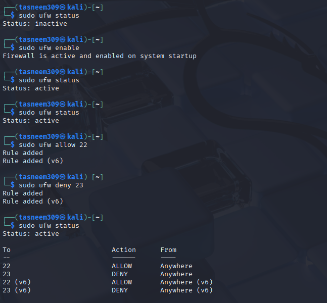

# Day 10 – Firewall Basics

## 1. Firewall Rules Created

In this task I used **UFW (Uncomplicated Firewall)** on Linux to try creating basic firewall rules.

- **Rule 1:** `sudo ufw allow 22` → This allows SSH traffic.
- **Rule 2:** `sudo ufw deny 23` → This blocks Telnet traffic.

After adding the rules, I noticed that they were applied for both **IPv4 and IPv6** automatically.

## 2. Difference Before vs After

**Before enabling the firewall:**

- The firewall status was `inactive`.
- This means the system wasn't actively filtering network traffic.

**After enabling the firewall:**

- The status changed to `active`.
- The firewall started applying the rules I created.
- Now traffic on **port 22** is allowed and traffic on **port 23** is blocked.

## 3. Why a Firewall Alone is Not Enough

A firewall is an important security layer, but it can't protect everything on its own.

For example:

- It filters traffic based on **ports and IP addresses**, but it can't detect malicious code inside allowed traffic.
- It mainly protects from **external threats**, not someone who already has access to the system.
- It also can't stop problems caused by **weak passwords, phishing, or users downloading malware**.

So even with a firewall, systems still need updates, monitoring, and other security practices.

## 4. One New Concept Learned

From this task I learned how to work with **UFW** to control network traffic.

