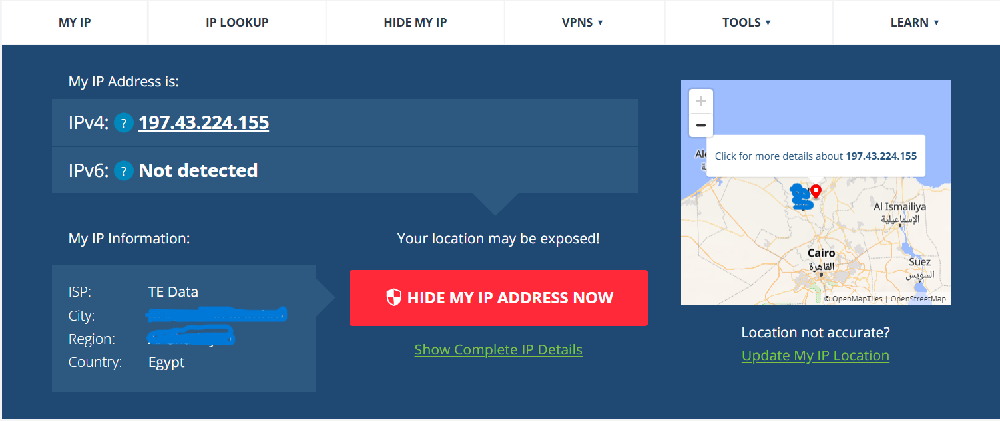
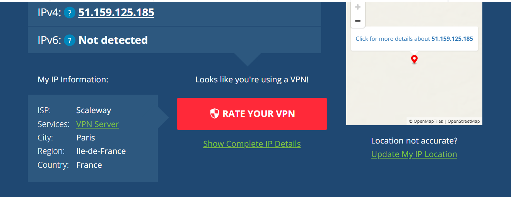

# Day 12 – VPN Basics

## 1. IP Before Connecting to VPN

Before connecting to a VPN, I checked my public IP using an online IP checker.

- **IP Address:** 197.43.224.155  
- **Location:** Egypt  
- **ISP:** TE Data  

## 2. IP After Connecting to VPN

After connecting to the VPN, I checked my IP again.

- **IP Address:** 51.159.125.185  
- **Location:** Paris, France  
- **ISP:** Scaleway  

From this result I noticed that my real IP changed and websites now see the IP of the VPN server instead of my original one.

## 3. One situation where a VPN is useful

A VPN can be very useful when using **public Wi-Fi** like in cafes or airports.  
It helps encrypt the traffic and makes it harder for someone on the same network to intercept the data.

## 4. One thing a VPN does NOT hide

A VPN does not completely hide your identity if you are **logged into your personal accounts** (like Google or Facebook).  
Those services can still track activity through your account.

## 5. One incorrect belief I had about VPNs

Before this task, I thought that using a VPN makes me **completely anonymous on the internet**.

But I learned that this is not fully true, because websites can still track users through things like **cookies or browser fingerprinting**.
