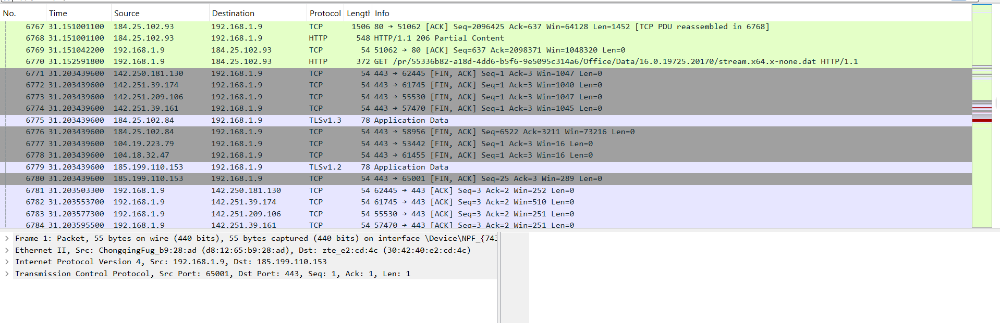
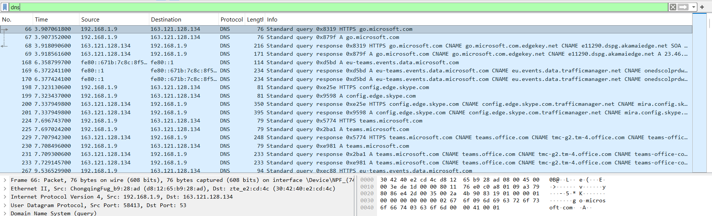

# Day 13 – Network Traffic Analysis (Wireshark)

## 1. One protocol I observed

While checking the captured traffic, I noticed the **DNS (Domain Name System)** protocol appearing frequently.

For example, there were DNS requests for domains like `go.microsoft.com` and `teams.microsoft.com`.  
These requests are used to translate domain names into IP addresses so the computer can connect to the correct server.

## 2. Approximately how many packets were captured?

In just a few minutes of capture, Wireshark recorded about **15,616 packets**.  
I didn't expect the number to be that high for such a short time.

## 3. One thing that surprised me

One thing that surprised me was the **amount of background traffic** happening even when I wasn't actively doing anything.

Applications like **Microsoft Teams and Skype** were still generating network traffic in the background.  
It made me realize that the network is much more active than it looks.

## 4. Why packet capture can be sensitive

Packet capture can be sensitive because it shows a lot of details about network activity.

For example, it can reveal:
- The source and destination of connections
- The domains a user is visiting
- The applications communicating over the network

If the traffic is **unencrypted (like HTTP)**, some private data or credentials could also be visible.

### General Traffic Capture (TCP, HTTP, TLS)

### Filtered DNS Traffic

